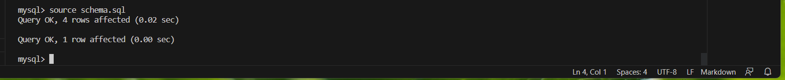
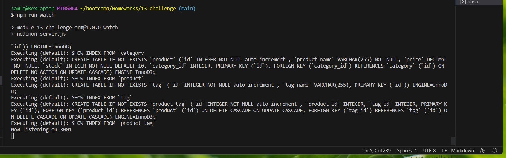
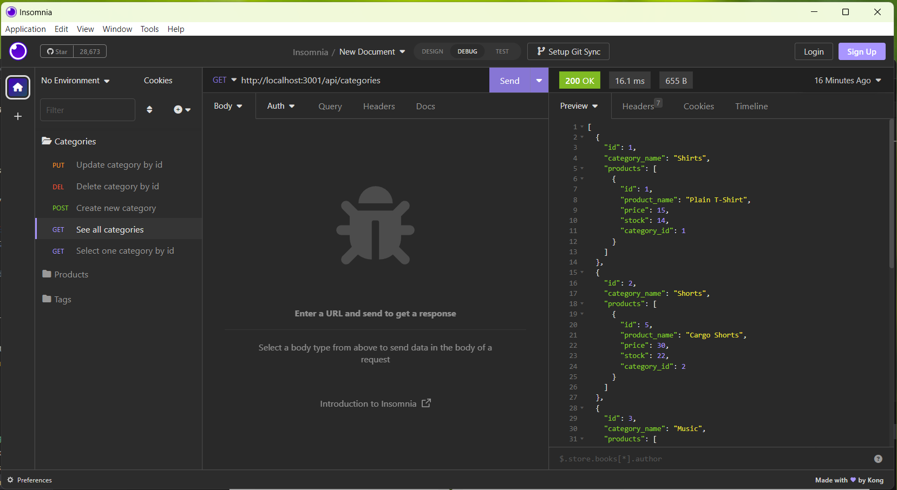

# Ecommerce Back-End Database

## Description
This project uses Sequelize to create and fill a database for an ecommerce website. The database has three tables with various relationships and connections between them. There are back-end routes to create, read, update, and delete information from the three tables. I enjoyed getting to practice Sequelize and especially enjoyed creating the models for the three tables. 

## Installation
This project requires users to install Node, MySQL, and Sequelize. Once these are installed users can follow the usage instructions below to get started.

## Usage
Here is a video showing the functionality of this project: https://drive.google.com/file/d/1VbMlWcNiI6nlSDHgoGdRKjA3awysmkjK/view

Generate the database by entering 'mysql -u root -p' in the schema.sql terminal. The following screenshot shows a successful instance of generating the database:

 In the server.js terminal, seed the database with command 'npm run seed', then start the server with command 'npm run watch'. The server is running when the terminal states "Now listening on 3001." The following screenshot shows what users will see after running 'npm run watch'.
 
 

 Users can now use Insomnia to view, update, create, and delete items in the database. The following screenshot shows an example of a GET request in Insomnia:

 

## Credits
In product-routes.js, line 13, he Sequelize documentation was helpful in learning how to include multiple models in a route. The link for the documentation used is here: https://sequelize.org/docs/v6/advanced-association-concepts/eager-loading/#multiple-eager-loading.

This project was built on starter code provided by EdX bootcamps. I learned how to complete this project by using the activities in module 13.

## License
The MIT License (MIT)
Copyright © 2023

Permission is hereby granted, free of charge, to any person obtaining a copy of this software and associated documentation files (the “Software”), to deal in the Software without restriction, including without limitation the rights to use, copy, modify, merge, publish, distribute, sublicense, and/or sell copies of the Software, and to permit persons to whom the Software is furnished to do so, subject to the following conditions:

The above copyright notice and this permission notice shall be included in all copies or substantial portions of the Software.

THE SOFTWARE IS PROVIDED “AS IS”, WITHOUT WARRANTY OF ANY KIND, EXPRESS OR IMPLIED, INCLUDING BUT NOT LIMITED TO THE WARRANTIES OF MERCHANTABILITY, FITNESS FOR A PARTICULAR PURPOSE AND NONINFRINGEMENT. IN NO EVENT SHALL THE AUTHORS OR COPYRIGHT HOLDERS BE LIABLE FOR ANY CLAIM, DAMAGES OR OTHER LIABILITY, WHETHER IN AN ACTION OF CONTRACT, TORT OR OTHERWISE, ARISING FROM, OUT OF OR IN CONNECTION WITH THE SOFTWARE OR THE USE OR OTHER DEALINGS IN THE SOFTWARE.